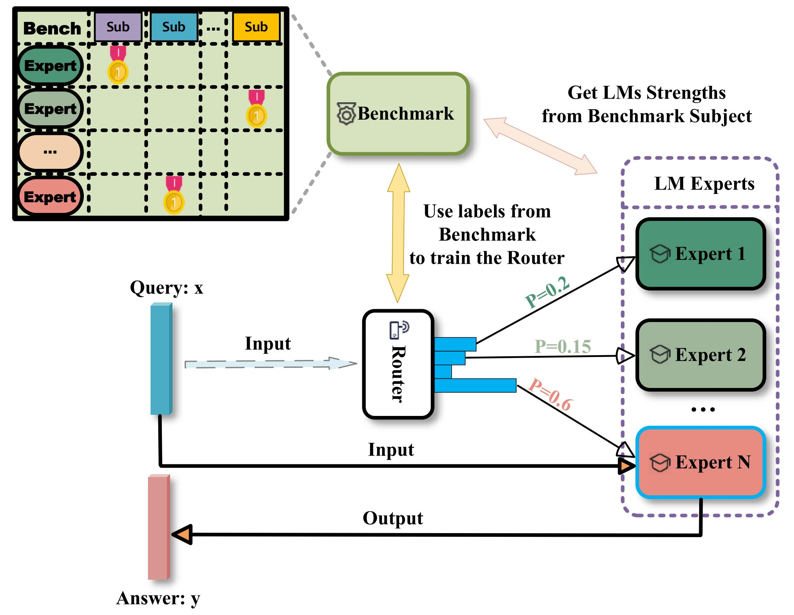

<h2 align="center"><a>Bench-CoE: a Framework for Collaboration of Experts from Benchmark</a><h5 align="center">

## HighLights:
Bench-CoE: a simple and efficient pipeline for combining and routing LLM-driven experts, which achieves flexible and efficient task routing without relying on extensive labeled data and large-scale training.



## Main Results:


## Test CoE Model:

### Language Models:
#### Environment Setup
- `environment.yml`: Contains a list of Python dependencies and their versions, essential for setting up the development environment.

#### Code
##### Evaluation Scripts
The scripts in the `/coe evaluation` directory are designed to evaluate various aspects of trained models:
- `eval_bbh_vllm_query.py`: Evaluates the performance of query-level Bench-CoE on the Big Bench Hard dataset.
- `eval_bbh_vllm_subject.py`: Evaluates the performance of subject-level Bench-CoE on the Big Bench Hard dataset.
- `eval_hellaswag_vllm_query.py`: Evaluates the performance of query-level Bench-CoE on the hellaswag dataset.
- `eval_mmlu_pro_vllm_query.py`: Evaluates the performance of query-level Bench-CoE on the MMLU Pro dataset.
- `eval_mmlu_pro_vllm_subject.py`: Evaluates the performance of subject-level Bench-CoE on the MMLU Pro dataset.
- `eval_winogrand_vllm_query.py`: Evaluates the performance of query-level Bench-CoE on the Winogrande dataset.

#### Instruction

1. Setting Up the Conda Environment
Begin by installing and setting up a Conda environment tailored for your project. This ensures that all dependencies are managed and isolated effectively.

2. Downloading Pre-trained BERT Router Models
Clone the following repositories to download the pre-trained weights for various BERT router models from Hugging Face:
   ```bash
   git clone https://huggingface.co/LambdaZ27/subject_bert_mmlu_pro
   git clone https://huggingface.co/LambdaZ27/query_bert_mmlu_pro
   git clone https://huggingface.co/LambdaZ27/query_bert_hellaswag
   git clone https://huggingface.co/LambdaZ27/query_bert_winogrande
   ```

3. Downloading and Setting Up Large Models as Sub-models
Download the desired large models to be used as sub-models to your local environment. Modify the paths in your code to point to these model files accordingly.

4. Downloading Datasets from Hugging Face
Obtain the relevant datasets from Hugging Face, ensuring compatibility with your model's training or testing requirements.

5. Running the Test Scripts
Execute the appropriate test files to evaluate the models and verify their performance.

### Multimodal Models:

#### Test CoE model by lmms-eval

1. Install the environment based on lmms-eval and the selected model.

2. Download pre-trained router model [subject_bert_mmmu](https://huggingface.co/Zhang199/subject_bert_mmmu).

3. Place `coemodel.py` in the `.lmms_eval/models` directory and modify 'AVAILABLE_MODELS' list in `__init__.py`

4. Modify the paths for the model and the router in the code.

5. Run the command and select the corresponding task to test coemodel:
   ```Shell
   CUDA_VISIBLE_DEVICES=0 python3 -m accelerate.commands.launch --num_processes=8 -m lmms_eval --model coemodel --model_args pretrained="None" --tasks name --batch_size 1 --log_samples --log_samples_suffix coemodel --output_path ./logs/
   ```

Note: As long as the selected model and task are supported by lmm-eval, you only need to make the necessary modifications in `coemodel.py`.

#### Test CoE model by yourself(case):

1. Install the environment based on [TinyLLaVA_Factory](https://github.com/TinyLLaVA/TinyLLaVA_Factory) and [Bunny](https://github.com/BAAI-DCAI/Bunny), prepare the corresponding dataset.

2. Download pre-trained router model [subject_bert_mmmu](https://huggingface.co/Zhang199/subject_bert_mmmu).

3. Run the command to test coemodel on the MMMU dataset:
   ```Shell
   CUDA_VISIBLE_DEVICES=0 bash path/to/eval_coe_mmmu.sh
   ```

Note: When using this method, if you need to add a model, make modifications according to the loading method of the corresponding model.

## ❤️ Community efforts

* Our model utilizes the [bert-base-uncased](https://huggingface.co/google-bert/bert-base-uncased). We extend our gratitude to the Hugging Face community for providing open access to this foundational technology, which has significantly propelled our research and development efforts.

* Our multimodal model experiments is built upon the [lmms-eval](https://github.com/EvolvingLMMs-Lab/lmms-eval) project. Great work!
